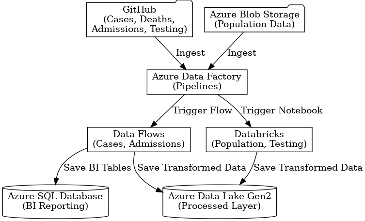

# 📊 Project Summary: Azure Data Factory Pipeline for COVID-19 Data Integration

This project showcases a complete **data integration pipeline** built using **Azure Data Factory**, designed to ingest, transform, and store COVID-19 and population-related datasets from multiple sources for **BI reporting** and **AI/ML analysis**.

---

## ✅ Key Features

- **Multi-source ingestion** from:
  - Public **GitHub repositories**:
    - `cases_deaths.csv`
    - `country_response.csv`
    - `hospital_admissions.csv`
    - `testing.csv`
  - **Azure Blob Storage**:
    - `population_data.csv`

- **Data transformation** using:
  - **Azure Data Flows** (structured transformation for cases and hospital data)
  - **Azure Databricks** (advanced transformations for population and testing data)

- **Data storage** in:
  - **Azure Data Lake Gen2** – Processed data for AI/ML
  - **Azure SQL Database** – Cleaned and aggregated data for BI reporting

---

## 🛠 Tools & Technologies

- Azure Data Factory (Pipelines, Data Flows)
- Azure Databricks (Python Notebooks)
- Azure Blob Storage
- Azure SQL Database
- Azure Data Lake Storage Gen2
- GitHub

---

## 💼 Use Case

This pipeline supports:

- **Business Intelligence Dashboards** (via Power BI using Azure SQL)
- **Machine Learning Model Training** (using curated datasets in Azure Data Lake)

---

## 🗺 Architecture Diagram

---

